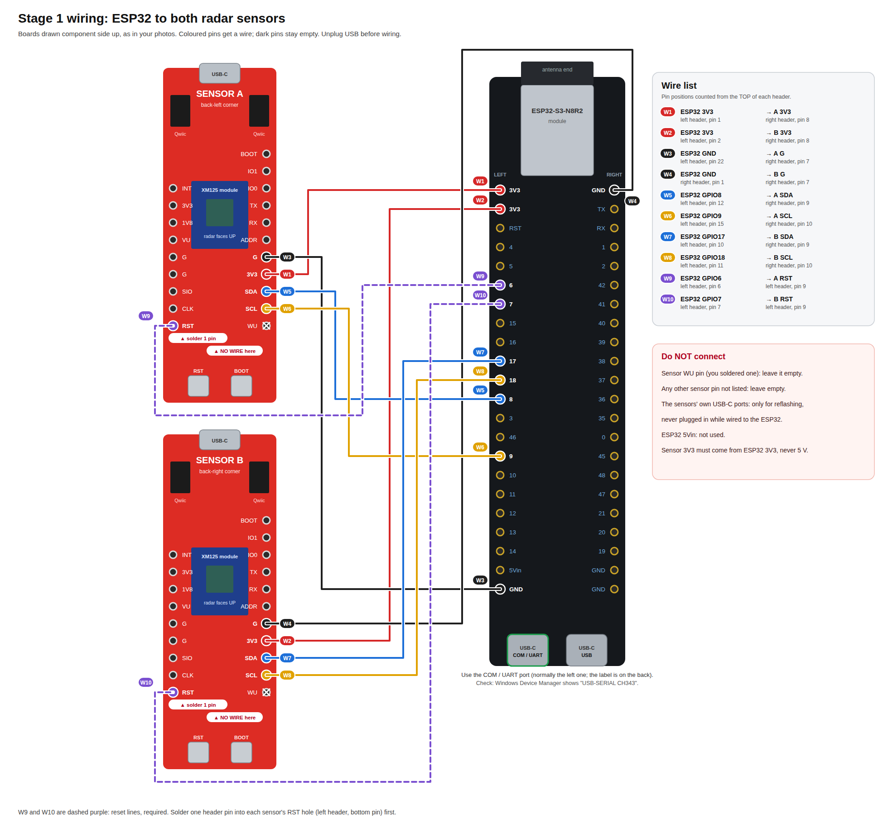
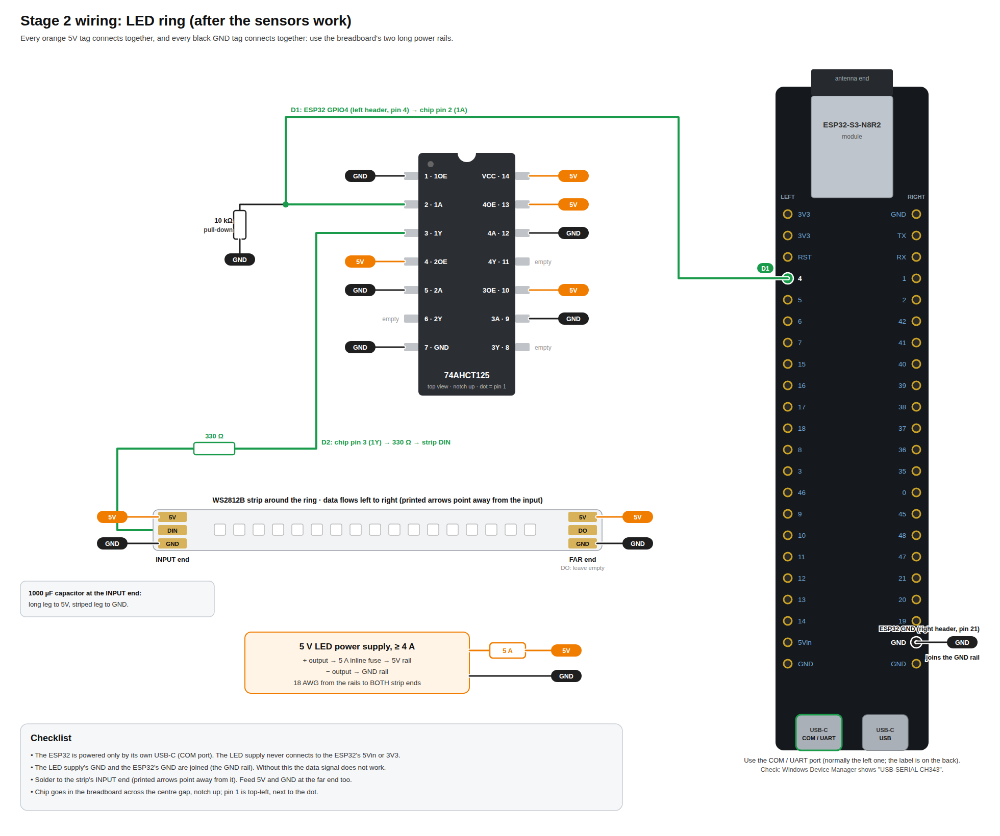
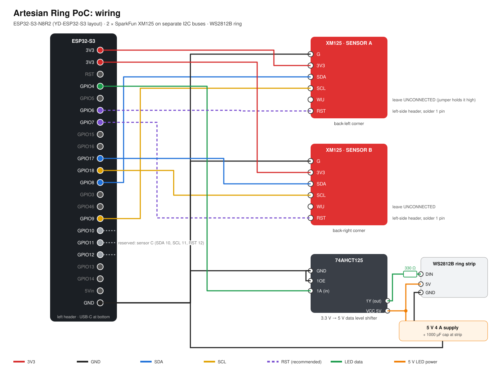

# 03 · Pin Layout and Wiring

## Build diagrams (real board layouts)

**Stage 1: sensors.** Wire this first.



**Stage 2: LED ring.** Wire this after the sensors work.



**Overview schematic:**



All three diagrams are generated from `firmware/include/pins.h` (`tools/make_board_diagrams.py` and `tools/make_wiring_svg.py`), so they always match the firmware. Board layouts were checked against the ESP32-S3-DevKitC-1 pinout and the SparkFun XM125 product photo.

## Why two I2C buses
Both XM125 boards answer at I2C address **0x52**. SparkFun documents the ADDR jumper as not yet implemented, so the boards cannot share a bus. The ESP32-S3 has two hardware I2C controllers, and each sensor gets one. No jumpers to solder. (Bench test T1 checks whether the ADDR pad works after all; see review R3.)

## Connection table

The stage 1 ESP32 pins are on the **left header** (the side labelled 3V3, 3V3, RST, 4, 5, 6, 7 ...), except one GND on the right header. The wire numbers W1 to W10 match the stage 1 diagram.

| ESP32-S3 pin | Goes to | Wire colour | Notes |
|---|---|---|---|
| 3V3 (left, pin 1) | Sensor A **3V3** (right header, pin 8) | red | W1 |
| 3V3 (left, pin 2) | Sensor B **3V3** (right header, pin 8) | red | W2 |
| GND (left, pin 22 = bottom) | Sensor A **G** (right header, pin 7) | black | W3 |
| GND (right, pin 1 = top) | Sensor B **G** (right header, pin 7) | black | W4. All ESP32 GND pins are connected together, so any GND works |
| GPIO8 (left, pin 12) | Sensor A **SDA** (right header, pin 9) | blue | W5, I2C bus 0 |
| GPIO9 (left, pin 15) | Sensor A **SCL** (right header, pin 10) | yellow | W6, I2C bus 0 |
| GPIO17 (left, pin 10) | Sensor B **SDA** (right header, pin 9) | blue | W7, I2C bus 1 |
| GPIO18 (left, pin 11) | Sensor B **SCL** (right header, pin 10) | yellow | W8, I2C bus 1 |
| GPIO6 (left, pin 6) | Sensor A **RST** (left header, pin 9 = bottom) | purple | **required**: firmware hard-resets a hung sensor (T14). Driven open-drain: only ever pulled low, never driven high |
| GPIO7 (left, pin 7) | Sensor B **RST** (left header, pin 9 = bottom) | purple | **required**, same as A |
| GPIO4 (left, pin 4) | 74AHCT125 **1A** (chip pin 2) → **1Y** → 330 Ω → strip **DIN** | green | LED ring data |
| GPIO15 / GPIO16 | Sensor A / B **INT** | n/a | optional, not wired for now |
| GPIO10 / 11 / 12 | reserved: Sensor C SDA / SCL / RST | n/a | future third sensor, read by switching I2C controller 1 between pin pairs (review R6) |
| GND (right, pin 21) | Stage 2: the breadboard GND rail (LED supply ground) | black | the LED ground must join the ESP32 ground |
| GPIO48 | onboard RGB LED | n/a | status light: green OK, blue a device connected, red a check failing, amber BOOT held (under 3 s), purple held 3 to 8 s (calibration), white ×3 at 10 s (password reset) |
| GPIO0 | onboard BOOT button | n/a | while running: short press = clean mode, 3 to 8 s = start calibration, 10 s = reset Wi-Fi password and PIN (troubleshooting U4). Never hold it while plugging in: that enters download mode |

**Sensor pins NOT to connect:**
- **WU:** you soldered a header pin here on one board. Leave it unconnected. The WU jumper on the board already ties it to 3V3 so the sensor stays awake. Wiring it to a GPIO would fight the jumper.
- **ADDR, INT, IO0, IO1, TX, RX, BOOT, VU, 1V8, SIO, CLK:** leave unconnected.
- **RST** is on the XM125's *other* header strip (left side, bottom). Solder one header pin there on each board.

**Level shifter (74AHCT125, DIP-14):** VCC (pin 14) to 5 V, GND (pin 7) to common ground. **1OE (pin 1) to GND** enables the channel used. Unused channels: tie **2OE, 3OE, 4OE (pins 4, 10, 13) to 5 V** (disabled) and **2A, 3A, 4A (pins 5, 9, 12) to GND**. No input is ever left floating. Channel 1: 1A (pin 2) from GPIO4, 1Y (pin 3) to the 330 Ω resistor. A **10 kΩ resistor from 1A (pin 2) to GND** holds the data line low while the ESP32 boots, so the ring cannot flash random colours at power-up (troubleshooting L7).

**No level shifter on hand? Two stopgaps, in order of preference:**
1. **Sacrificial first pixel.** Cut one LED off the strip and wire it in *before* the strip. Feed its 5V pad through a **silicon** diode (1N4001 or 1N4148), so it runs at about 4.3 V and reliably accepts a 3.3 V data signal. Do not use a Schottky diode (such as a 1N5819): it only drops about 0.3 V, which leaves no margin. Its DOUT then drives the rest of the strip with a clean full-strength signal.
2. **Direct drive.** GPIO4 → 330 Ω → DIN, with the data wire under 15 cm. This often works but can flicker. Fine for bench testing, not for an investor demo.

Buy the 74AHCT125 for the demo build. It is the only one of the three with no failure mode.

**Identify the strip before soldering.** Read the pad labels at the cut point:
- **5V, DIN (or DI), GND:** addressable 5 V strip (WS2812B / SK6812). **Use this one.**
- **12V, DI, BI, GND:** addressable 12 V strip (WS2815). Usable, but it needs a 12 V supply. BI is a backup data line: tie it to GND at the input end.
- **12V (or 5V), R, G, B:** plain RGB strip. **Not usable here.** The whole strip shows one colour, and it needs driver transistors. This is the type the white controller box runs.

Solder to the **input** end: the printed arrows point away from it (DIN, not DOUT).

**LED power:**
- The 5 V supply (at least 4 A) feeds the strip **at both ends**: its start and its far end, which meet back near the start because the strip runs around the ring. Use 18 AWG or heavier wire for the 5 V and GND runs.
- Put a 5 A inline fuse on the supply's 5 V lead and a 1000 µF capacitor across 5V/GND at the input end.
- The strip never draws power through the ESP32.
- Firmware caps brightness at 90/255, about 2.8 A worst case.

## Power
- **Bench and programming:** power the ESP32 over USB-C from the laptop, through the port marked **COM / UART** (CH343 chip).
- **Demo:** power the ESP32 from a 5 V USB-C wall adapter (1 A or more) in the same COM port. Plug that adapter and the LED supply into **one switched power strip**, so both come on and off together (review R23).
- The XM125 boards take 3.3 V from the ESP32 3V3 pins. Do **not** plug USB into an XM125 while it is wired to the ESP32. Their USB ports are only for reflashing.

## Cable runs
- I2C is designed for short runs. Keep each sensor cable **under 50 cm** at 400 kHz. If a run has to be longer (up to about 1 m), set `I2C_FREQ_HZ` to 100000 in `pins.h`.
- Twist SDA with GND and SCL with 3V3 on each run, or use a 4-core Qwiic cable with a female-jumper end.

## Sensor placement (plan view, facing the sink)

```
      back edge of sink opening (ring)
  A ●──────────────────────────────────────● B
    │ ↘ aim 45° in, tilt ~20° down   ↙     │
    │  Soap     │  Disposal  │  Cup fill   │  back
    │───────────┼────────────┼─────────────│
    │ Waterfall │  Neutral   │  Waterfall  │  middle
    │───────────┼────────────┼─────────────│
    │   Hot     │   Warm     │    Cold     │  front
    └──────────────────────────────────────┘
      front edge (user stands here)          23 in wide × 21 in deep
      reserved: sensor C at front-centre
```

Measure and enter the real positions, height and angles in the calibration studio (spec section 8). Firmware never assumes them.
